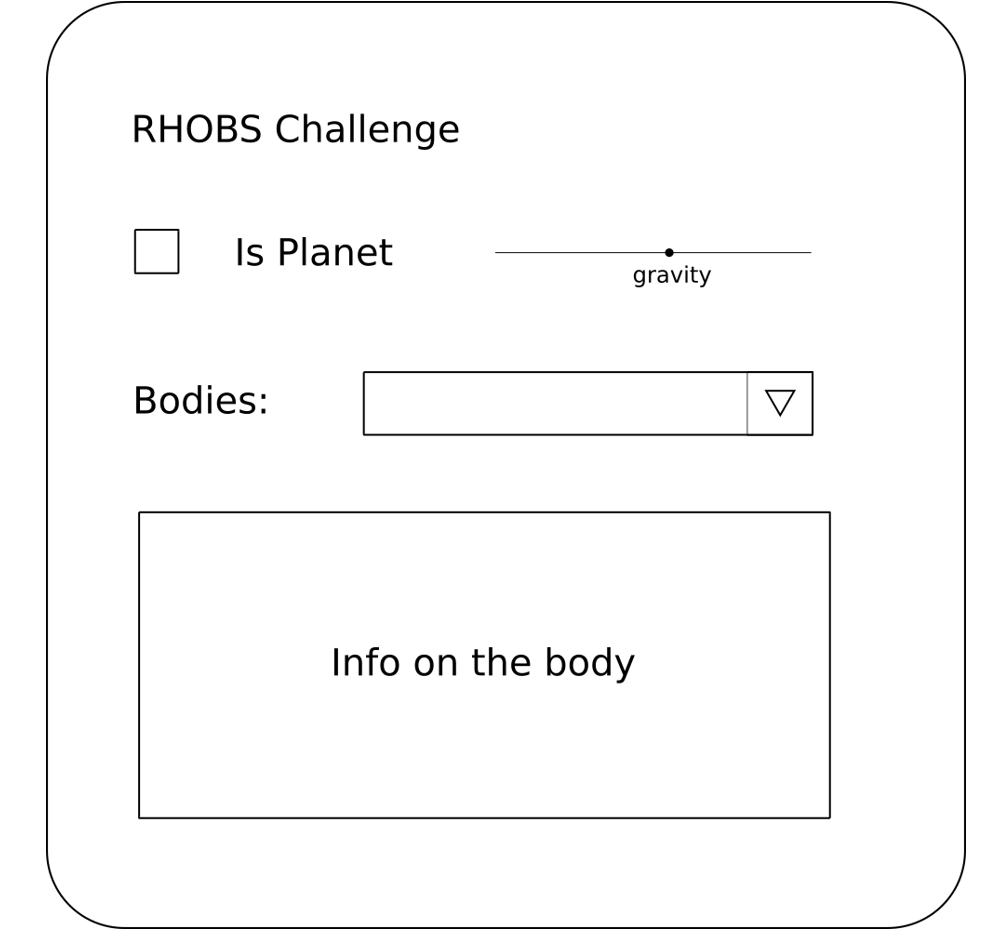
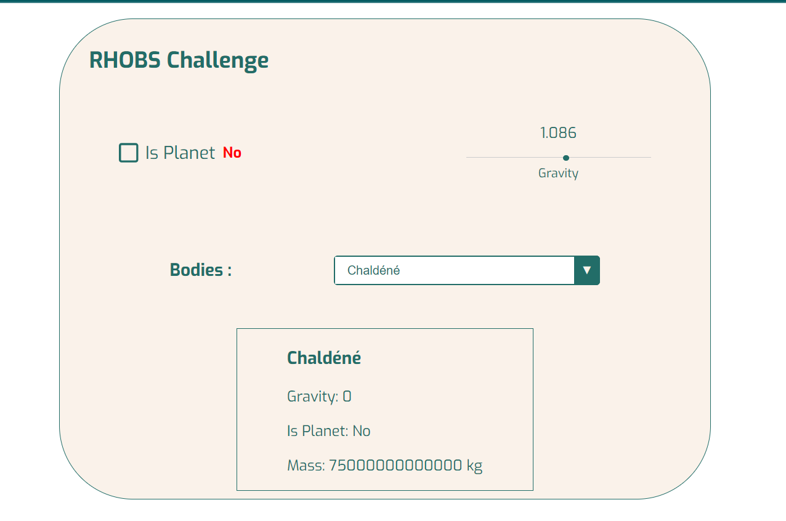

## RHOBS CODING CHALLENGE FOR WEB INTEGRATION

This is a simple web integration project that uses the following technologies REACT

this is the test design

### Getting Started

this is the design interface that I made

